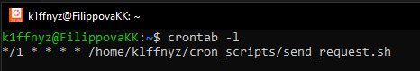
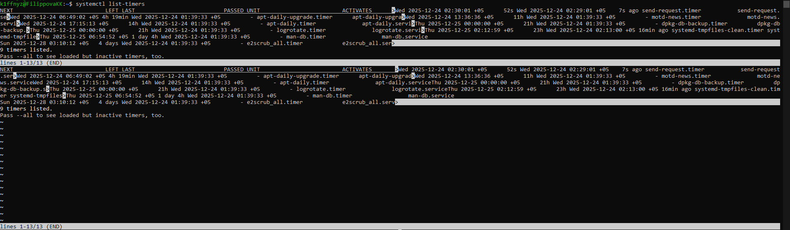
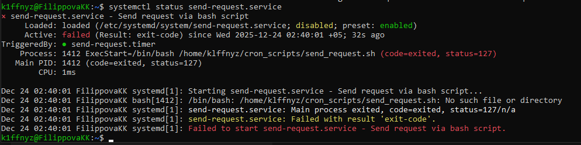
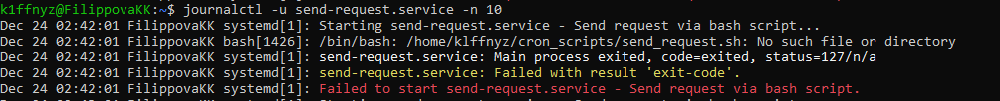

# practice4.cron-vs-systemd

Практическая работа по изучению и сравнению механизмов планирования задач в Linux: **cron** и **systemd timers**.

## Описание

В рамках данной работы рассматриваются два подхода к планированию периодических задач в Linux:
- классический планировщик **cron**
- современный механизм **systemd timers**

Для обоих подходов реализована одинаковая задача — периодический запуск bash-скрипта с логированием результата.

## 🛠 Используемые инструменты

- cron
- systemd
- bash
- Linux (Ubuntu, WSL2)
- Git
- GitHub

## 💻 Требования к окружению

Для выполнения работы требуется Linux-окружение.

Поддерживаемые варианты:
- Ubuntu 20.04 / 22.04 / 24.04
- WSL2 (Windows Subsystem for Linux)

## 📁 Структура проекта

```text
practice4.cron-vs-systemd
├── README.md
├── cron_scripts
│   └── send_request.sh
└── systemd
    ├── send-request.service
    └── send-request.timer
```

## 📸 Скриншоты выполнения

### Cron


### Systemd timer


### Systemd service


### Логи выполнения



## ⚠️ Особенности среды WSL
При запуске systemd-сервиса в среде WSL фиксируется ошибка выполнения (`status=203/EXEC`), связанная с ограничениями systemd в Windows Subsystem for Linux. Unit-файл и таймер настроены корректно, что подтверждается логами systemd. В классической Linux-среде данный сервис запускается без ошибок.
